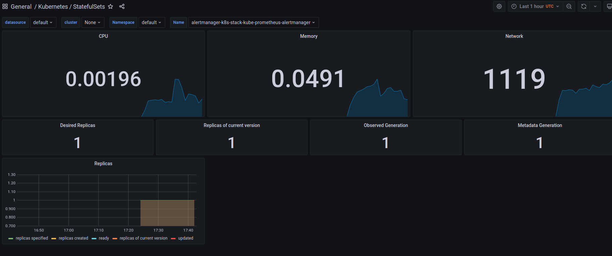
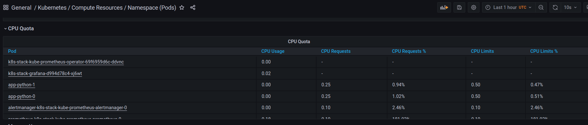
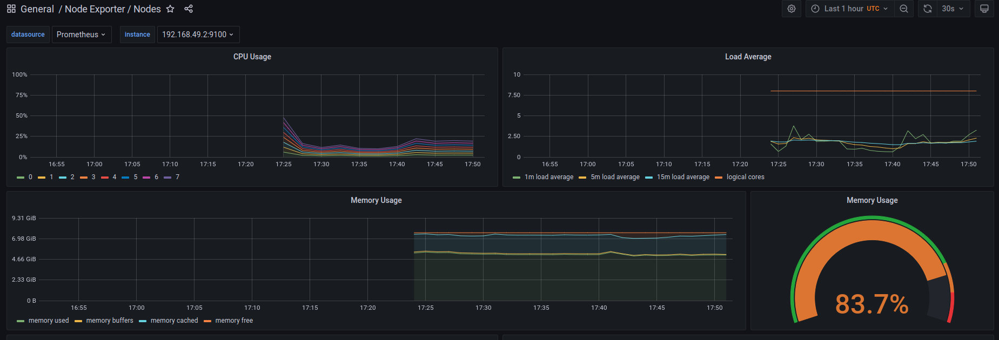
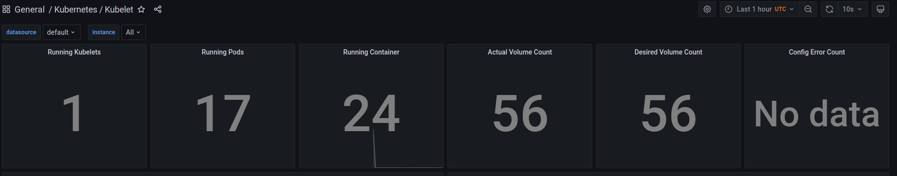
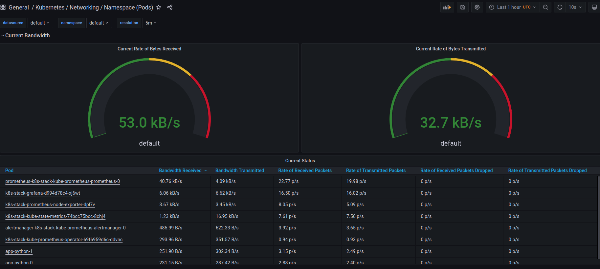
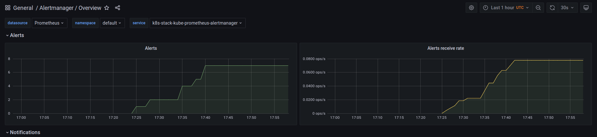

# Kube Prometheus Stack

## Description of components
* Prometheus Operator - Prometheus and related monitoring components are deployed and managed natively in Kubernetes via the Prometheus Operator. The goal is to make setting up a Prometheus-based monitoring stack for Kubernetes clusters easier and more automated.
* Prometheus - is a tool for gathering and storing app metrics.
* Alertmanager - Client applications, such as the Prometheus server, send alerts to the Alertmanager. It handles deduplication, grouping, and routing to the appropriate receiver integrations like email, PagerDuty, and OpsGenie. It also handles alert suppression and inhibition.
* Node exporter - Prometheus exporter written in Go.
* Prometheus Adapter for Kubernetes Metrics APIs - The Prometheus Adapter allows us to take advantage of Prometheus's measurements and use them to make scaling decisions.
* kube-state-metrics - KSM is a simple service that listens to the Kubernetes API server and generates metrics about object state. It focuses on the health of the many objects inside Kubernetes, such as deployments, nodes, and pods.
* Grafana - metrics visualization tool.
## Installed chart proof

```
kubectl get po,sts,svc,pvc ->
NAME                                                        READY   STATUS    RESTARTS   AGE
pod/alertmanager-k8s-stack-kube-prometheus-alertmanager-0   2/2     Running   0          83s
pod/app-python-0                                            1/1     Running   0          26m
pod/app-python-1                                            1/1     Running   0          26m
pod/k8s-stack-grafana-d994d78c4-sx5qt                       2/2     Running   0          102s
pod/k8s-stack-kube-prometheus-operator-69f6959d6c-ckwlp     1/1     Running   0          102s
pod/k8s-stack-kube-state-metrics-74bcc75bcc-zhvpt           1/1     Running   0          102s
pod/k8s-stack-prometheus-node-exporter-pbnvb                1/1     Running   0          102s
pod/prometheus-k8s-stack-kube-prometheus-prometheus-0       2/2     Running   0          81s

NAME                                                                   READY   AGE
statefulset.apps/alertmanager-k8s-stack-kube-prometheus-alertmanager   1/1     83s
statefulset.apps/app-python                                            2/2     27m
statefulset.apps/prometheus-k8s-stack-kube-prometheus-prometheus       1/1     81s

NAME                                             TYPE           CLUSTER-IP       EXTERNAL-IP   PORT(S)                      AGE
service/alertmanager-operated                    ClusterIP      None             <none>        9093/TCP,9094/TCP,9094/UDP   83s
service/app-python                               LoadBalancer   10.107.137.111   <pending>     5000:31521/TCP               27m
service/k8s-stack-grafana                        ClusterIP      10.98.136.212    <none>        80/TCP                       102s
service/k8s-stack-kube-prometheus-alertmanager   ClusterIP      10.96.64.237     <none>        9093/TCP                     102s
service/k8s-stack-kube-prometheus-operator       ClusterIP      10.102.103.201   <none>        443/TCP                      103s
service/k8s-stack-kube-prometheus-prometheus     ClusterIP      10.97.47.240     <none>        9090/TCP                     103s
service/k8s-stack-kube-state-metrics             ClusterIP      10.99.143.1      <none>        8080/TCP                     102s
service/k8s-stack-prometheus-node-exporter       ClusterIP      10.97.13.186     <none>        9100/TCP                     103s
service/kubernetes                               ClusterIP      10.96.0.1        <none>        443/TCP                      43m
service/prometheus-operated                      ClusterIP      None             <none>        9090/TCP                     81s

NAME                                        STATUS   VOLUME                                     CAPACITY   ACCESS MODES   STORAGECLASS   AGE
persistentvolumeclaim/visits-app-python-0   Bound    pvc-c20377c0-c84f-43ec-b9f9-d0d062b38b20   1Gi        RWO            standard       42m
persistentvolumeclaim/visits-app-python-1   Bound    pvc-20192b00-abe2-4c90-b62e-80be5cf83dd9   1Gi        RWO            standard       37m
```
## Metrics
# 1

# 2
app-python and alert manager almost not consume cpu; Prometheus consumes 19%


# 3
Node uses 5.05 GiB of RAM


# 4
Kubelet runs 17 pods


# 5

Prometheus using network more than others; The python app less than others


# 6

Total 7 alerts

