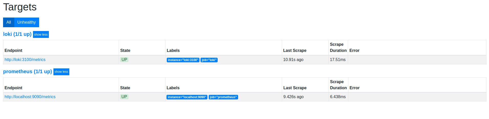

# Logging
## Description and proofs
Logs are collected from the app and show in Grafana.

Targets discovered by prometheus

Loki dashboard

Prometheus dashboard

## Best practices I found
### 1 - Logging limit
Define the logging limit in order to save space on the servers
### 2 - Cache rotation
Use cache rotation to save the space
### 3 - Using volumes
Use grafana and prometheus volumes to not lose the state when restarting containers